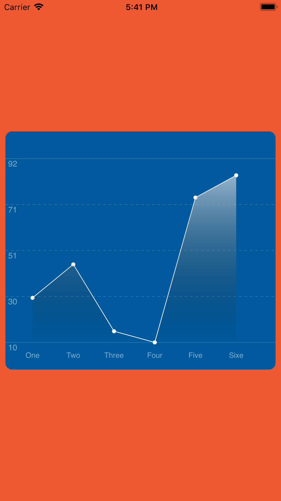

# LineChart in swift 4
This code demostarint how to create own line chart without using third party library. It is contain one small file LineChart.swift for linechart draw.


# How to use
Downlaod the project and drag LineChart.swift file in your project.

Create IBOutlet 

```
@IBOutlet weak var lineChartView: LineChart!

let dataEntries = generateRandomEntries()
lineChartView.dataEntries = dataEntries
lineChartView.layer.cornerRadius = 10.0
self.view.backgroundColor = #colorLiteral(red: 0.9372549057, green: 0.3490196168, blue: 0.1921568662, alpha: 1)


override func viewDidLoad() {
        super.viewDidLoad()
        let dataEntries = generateRandomEntries()
        lineChartView.dataEntries = dataEntries
        lineChartView.layer.cornerRadius = 10.0
        self.view.backgroundColor = #colorLiteral(red: 0.9372549057, green: 0.3490196168, blue: 0.1921568662, alpha: 1)
}


private func generateRandomEntries() -> [PointEntry] {
        let results = [PointEntry(value: 30.0, title: "One"),
                       PointEntry(value: 45.0, title: "Two"),
                       PointEntry(value: 15.0, title: "Three"),
                       PointEntry(value: 10.0, title: "Four"),
                       PointEntry(value: 75.0, title: "Five"),
                       PointEntry(value: 85.0, title: "Sixe")]
        return results
}

```




